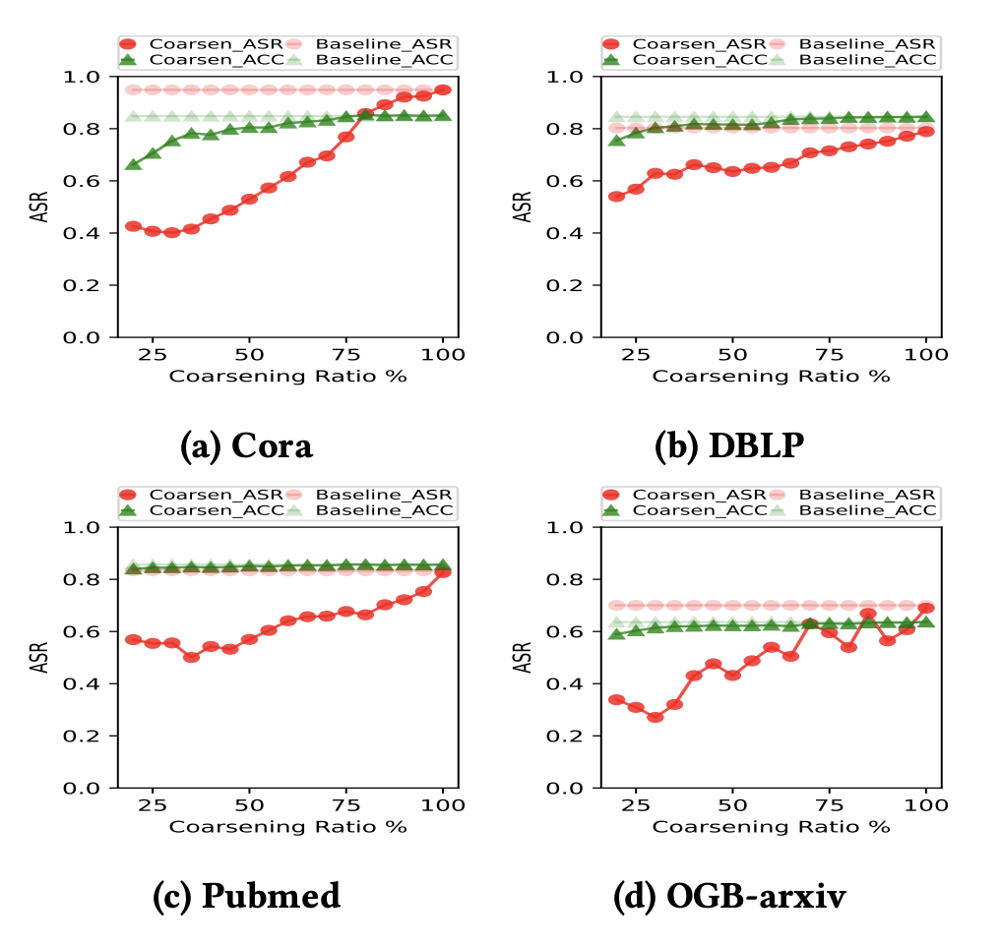
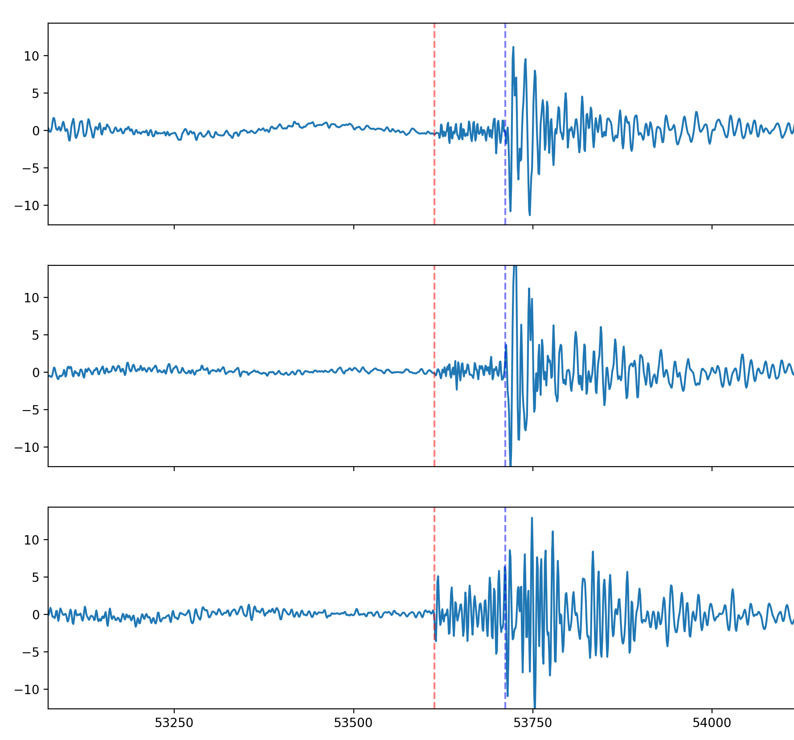

# About me
I am a Computer Science undergraduate student at [Rensselaer Polytechnic Institute](https://www.rpi.edu/) who expects to graduate in May 2023. I am honored to participate various research programs with been advised by Professor [Lei Yu](https://leiyucs.github.io/), [Bulent Yener](https://www.cs.rpi.edu/~yener/), and [Jianxi Gao](https://www.gaojianxi.com/). 

# Research
My research mainly lies in the intersection of machine learning, time series analysis, and system security. Specifically, I am interested in developing or taking advantage of efficient and robust deep learning models to solve real-world problems in various domains such as cybersecurity, biology, and geophysics.

Recently I have been working on the following projects:

## Robustness of Graph Reduction Against GNN attacks
We empirically investigate the robustness of graph reduction methods, algorithms that was originally aimed to accelerate the training of graph neural networks(GNNs), aginst various poisoning and backdoor attacks. 

## Time Series Analysis on Multivariate Seismic Data
We explored the performance of cutting-edge deep learning based time series models on tackling earthquake detection, phase identification, and onset time picking tasks under both supervised(classification) and unsupervised(anomaly detection) settings.

## Efficiently Solving Steady-State of Complex Dynamical Systems
We proposed a novel two-stage approach to efficiently compute steady stages in large-scale dynamical systems while maintaining the low state error. This method achieved a 2970-fold speedup compared to the traditional numerical integration method when dealing with 8000-node networks. 

# Publication
## Conference
### On the Robustness of Graph Reduction Against GNN Backdoor [[pdf](https://arxiv.org/pdf/2407.02431)]\ **ACM AISec 2024**

  Yuxuan Zhu, Michael Mandulak, **Kerui Wu**, George Slota, Yuseok Jeon, Ka-Ho Chow, Lei Yu

## Undergraduate Thesis
### 