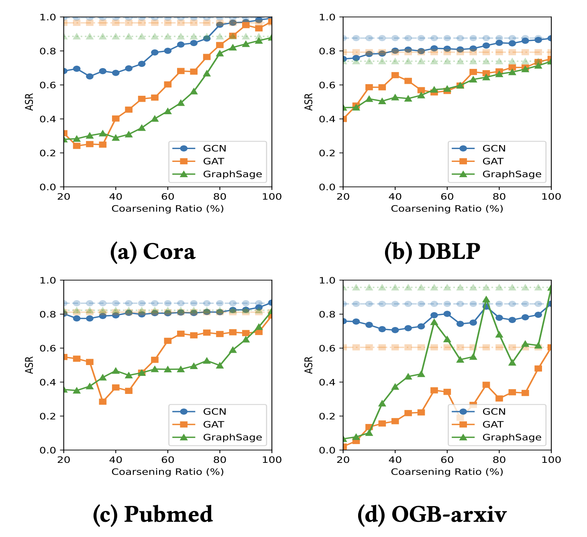
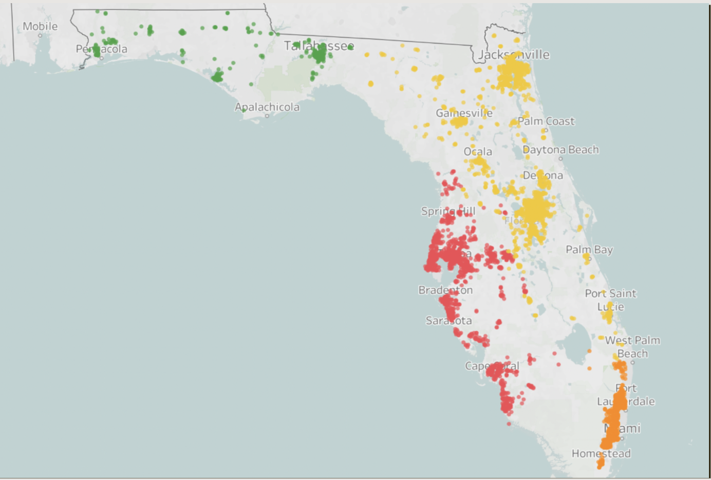
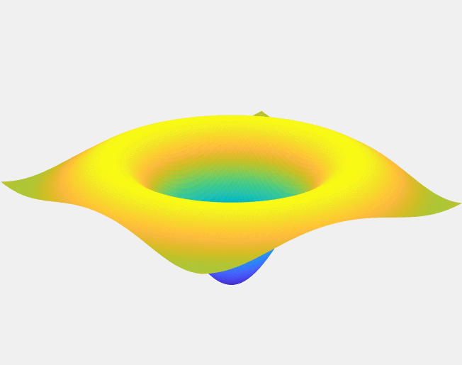
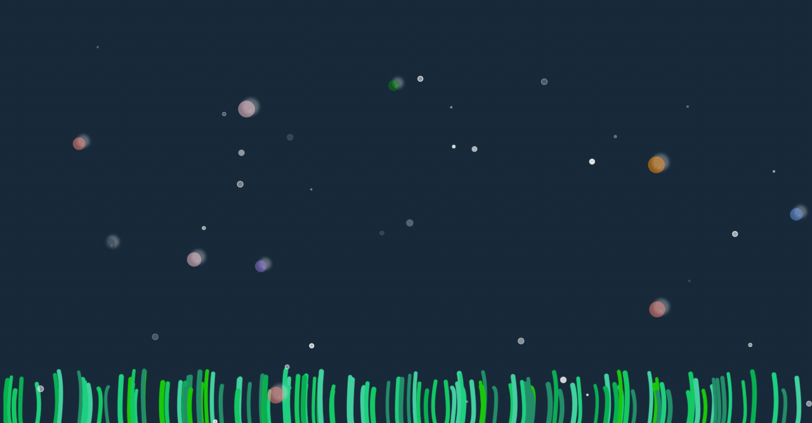

# About me
I am a Computer Science undergraduate student at [Rensselaer Polytechnic Institute](https://www.rpi.edu/) who expects to graduate in May 2025. I am honored to participate various research programs with been advised by Professor [Lei Yu](https://leiyucs.github.io/), [Bulent Yener](https://www.cs.rpi.edu/~yener/), and [Jianxi Gao](https://www.gaojianxi.com/). 

# Research
My research mainly lies in the intersection of machine learning, time series analysis, and system security. Specifically, I am interested in developing or taking advantage of efficient and robust deep learning models to solve real-world problems in various domains such as cybersecurity, biology, and geophysics.

Recently I have been working on the following projects:

* **Robustness of Graph Reduction Against GNN attacks**: We empirically investigate the robustness of graph reduction methods, algorithms that was originally aimed to accelerate the training of graph neural networks(GNNs), aginst various poisoning and backdoor attacks. 

* **Time Series Analysis on Multivariate Seismic Data**: We explored the performance of cutting-edge deep learning based time series models on tackling earthquake detection, phase identification, and onset time picking tasks under both supervised(classification) and unsupervised(anomaly detection) settings.

* **Efficiently Solving Steady-State of Complex Dynamical Systems**: We proposed a novel two-stage approach to efficiently compute steady stages in large-scale dynamical systems while maintaining the low state error. This method achieved a 2970-fold speedup compared to the traditional numerical integration method when dealing with 8000-node networks. 

# Publication
## Conference
### On the Robustness of Graph Reduction Against GNN Backdoor [[pdf](https://arxiv.org/pdf/2407.02431)]

Yuxuan Zhu, Michael Mandulak, **Kerui Wu**, George Slota, Yuseok Jeon, Ka-Ho Chow, Lei Yu

Accepted by **AISec 2024**

This paper conducts a thorough examination of the
robustness of graph reduction methods in scalable GNN training in
the presence of state-of-the-art backdoor attacks. We performed a
comprehensive robustness analysis across six coarsening methods
and six sparsification methods for graph reduction, under three
GNN backdoor attacks against three GNN architectures. Our findings indicate that the effectiveness of graph reduction methods in
mitigating attack success rates varies significantly, with some methods even exacerbating the attacks. Through detailed analyses of
triggers and poisoned nodes, we interpret our findings and enhance
our understanding of how graph reduction influences robustness
against backdoor attacks. These results highlight the critical need
for incorporating robustness considerations in graph reduction
for GNN training, ensuring that enhancements in computational
efficiency do not compromise the security of GNN systems.

## Undergraduate Thesis
### Identifying Vulnerable Child Care Centers Due to Effects of Temperature and Precipitation [[pdf](assets/file/childcare.pdf)]

**Kerui Wu**, Weihao Li, Yanfeng Liu, Chiting Lu, Jinhui Yu, Tianze Zhu, Thilanka Munasinghe

Childcare centers gather lots of children who need protection. Focusing on minimizing physical harm, the impact of natural hazards induced by precipitation and temperature fluctuations on childcare center buildings is a critical concern. Heavy rainfall and extreme temperatures can compromise structural integrity and pose health risks. Leveraging historical data from NASA's Global Precipitation Mission and childcare center locations from Homeland Infrastructure Foundation-Level Data, we processed and cleaned the dataset, utilizing machine learning clustering algorithms. The K-means clustering algorithm and Gaussian Mixture Model, among others, classified childcare centers based on precipitation and temperature data, with silhouette scores above 0.3. Visualization on a US map revealed varying risks among states, influenced by environmental factors. This study underscores the importance of incorporating additional elements like wind and snowfall in future research to assess childcare facility risks and regional vulnerabilities comprehensively.

### Femtosecond Laser Micro Machining [[pdf](assets/file/laser.pdf)]

**Kerui Wu**, Sixue Xing, Yuri V Lvov

We simulated the micro-machining process with a femtosecond laser using a mathematical model. The study involved identifying and developing a differential equation that could be applied in the simulation program. A 3D graph was generated to illustrate the relationship between the laser's radius and the density of free electrons, which serves as the criterion for determining the completion of the micro-machining process. Additionally, a C++ program was developed to simulate this process more efficiently, achieving faster runtime compared to Matlab.

 

# Technical Contribution
## China Construction Bank Achievement System
##### React.JS, Go, MySQL, Azure
[China Construction Bank](https://www.ccb.com/eng/home/index.shtml) is one of China's four major state-owned banks. The Dianlong Branch in Kunming is a secondary branch of the China Construction Bank, with 11 sub-branches in Kunming and hundreds of employees. To help the branch managers track and manage the performance of each sub-branch, position, and employee, I proposed and implemented a web-based performance tracking system with React.JS as frontend framework. Employees can submit their daily performance metrics, such as the amount of fixed deposits, current deposits, financial products sold, and the number of new accounts opened for customers. Managers can view performance scores calculated based on rules defined by the bank and systematically evaluate the performance of each employee. Comprehensive Restful APIs, with the use of GinGonic framwork written in Go, are provided for managers to sort and filter the data. **The system is currently used by all 11 sub-branches in Kunming city.**
 

## Submitty Open Source
##### HTML, JavaScript, PHP, SQL
[Submitty](https://submitty.org/index/overview) is an open source course management, assignment submission, exam and grading system that is widely used by Computer Science departments in Rensselaer Polytechnic Institute and other universities. I contributed to the development of the system as a [full-stack developer in 2023 spring](https://submitty.org/index/people) by implementing several new features like customizable pronouns setting, which involved front-end development using HTML and JavaScript, backend API creation with PHP, and database schema design using SQL. I also found and fixed several bugs in the system. So far, [5 of my pull requests](https://github.com/Submitty/Submitty/pulls?q=is:pr+author:keruiwu) have been merged into the main branch of the Submitty repository.
 
 

## Wox Translater Plugin
##### Python, BeautifulSoup
[Wox](http://www.wox.one/) is a full-featured launcher, access programs and web contents as you type. I developed a plugin for Wox that can translate English to Chinese and vice versa by scraping Cambridge dictionary using BeautifulSoup. Because of the nature of scraping, users can directly download the plugin to use without any registration or API key. The plugin is currenly live on the [Wox plugin store](http://www.wox.one/plugin/409).
 
 

## Ocean Dynamic Wallpaper
##### HTML, JavaScript
This is a dynamic wallpaper that simulates the ocean written in Canvas element in HTML and animation in JavaScript. Bubbles are generated with random radius, color, and moving speed, where users can click bubbles by tracking the mouse's coordinates. Project repository can be found in [GitHub](https://github.com/keruiwu/Ocean_Dynamic_Wallpaper). 